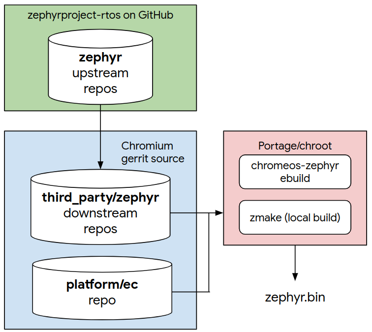

# Zephyr Embedded Controller (Zephyr EC)

[TOC]

## Introduction

Starting roughly in July of 2021, Chromebooks switched from the original [Google
Chrome EC](../../README.md) to an application based on the [Zephyr Project
RTOS](https://zephyrproject.org/).

The following terms are used to to describe these two implementations:

* Original Chrome EC: ECOS, cros-ec, and legacy EC
* Zephyr-based EC: Zephyr EC

## Getting Started

The [Zephyr build](zephyr_build.md) documentation details the usage of Google's
meta build tool `zmake`, used to configure and build Zephyr EC binaries. Start
here if you only need to build a Zephyr EC binary for an existing board.

The [project configuration](project_config.md) documentation details the steps
required to create a new Chromebook program (reference board) and for creating a
new project variant.

The [Zephyr New Board Checklist](zephyr_new_board_checklist.md) links to the
documentation needed to configure individual EC features.

The [Zephyr Troubleshooting](zephyr_troubleshooting.md) page lists few common
errors and troubleshooting techniques used when working with Zephyr.

## Source Code Organization

Zephyr EC images rely on multiple Chromium repositories to build Zephyr EC images.

* [`third_party/zephyr/main`] - Google's local mirror of the main Zephyr RTOS
  source located on [Github](https://github.com/zephyrproject-rtos/zephyr).
* [`third_party/zephyr/cmsis`] - Google's local mirror of the CMSIS module source
  from [Github](https://github.com/zephyrproject-rtos/cmsis)
* [`platform/ec`] - local repository containing code shared by the legacy EC and
  the Zephyr EC

The current Zephyr EC builds only the CMSIS module from the upstream Zephyr
source, but may use other modules in the future.

The diagram below shows the relationship of the upstream Zephyr repositories and
the Chromium repositories.

Google merges upstream Zephyr changes into the corresponding Chromium
repository daily.

### Shared Code

The two EC implementations currently share a significant amount code found in
the following directories (all paths relative to the Chrome EC base directory
[`platform/ec`].)

* `common/` - Upper-level code shared across boards and the EC implementations.
  This includes the following features:
  * Battery charging
  * USB Power Delivery
  * AP chipset power sequencing
  * Motionsense (EC sensor support)
  * Keyboard handling
  * Verified boot support

* `driver/` - Low-level drivers for on-board peripherals controlled by the EC.
  This does not include any drivers for modules integrated directly into the EC
  chipset (such as GPIO controllers, I2C, controllers, keyboard controller).
  On-board peripheral drivers include:
  * Charge controllers
  * USB Power Delivery chips (TCPCs, PPCs, muxes, etc)
  * Temperature sensors
  * Motionsense sensors (accelerometers, gyrscopes, light sensors, etc)

* `include/` - Header files for the `common/` and `driver/` code

The following legacy EC directories are not used by the Zephyr EC application:
* `baseboard/`
* `board/`
* `chip/`
* `core/`

### Zephyr Subdirectory

Only the Zephyr EC application uses the following directory under the
[`platform/ec`] repository:
* `zephyr/`

The following provides an overview of the sub-directories found under
`zephyr/`.

* `zephyr/app/` - The Zephyr EC application entry point. The Zephyr kernel
  calls [`ec_app_main()`] routine after initializing all kernel services and
  chip-level drivers,
* `zephyr/boards/` - Contains the EC chip-level support. This directory and the
  organization is required by the Zephyr build system.  This should not be
  confused with the legacy EC `boards/` directory, as it does not contain any
  Chromebook specific board code.
* `zephyr/cmake/` - Configuration files for the CMake build system.
* `zephyr/drivers/` - Drivers conforming to the Zephyr device model to
  implement Chrome EC specific features. Google plans to eventually move these
  drivers upstream.
* `zephyr/dts/` - Devicetree description files for Google's Zephyr drivers that
  are not yet available upstream.
* `zephyr/emul/` - Emulator source code that has not yet been moved upstream.
* `zephyr/include/` - Header files for files found in the `zephyr/`
  sub-directory.
* `zephyr/linker/` - Linker directive files used to construct the Zephyr EC
  binaries.
* `zephyr/program/` - Program-specific configurations for each program
  supported by Zephyr.
* `zephyr/shim/` - Source code that adapts the legacy EC APIs to the equivalent
  Zephyr OS API.
* `zephyr/subsys/` - Staging area for subsystem code that will be moved
  upstream.
* `zephyr/tests/` - Host based emulation tests.
* `zephyr/zmake/` - Source code for the `zmake/` meta tool.

[`third_party/zephyr/main`]: https://source.chromium.org/chromiumos/chromiumos/codesearch/+/main:src/third_party/zephyr/main
[`third_party/zephyr/cmsis`]: https://source.chromium.org/chromiumos/chromiumos/codesearch/+/main:src/third_party/zephyr/cmsis
[`platform/ec`]: https://source.chromium.org/chromiumos/chromiumos/codesearch/+/main:src/platform/ec
[`ec_app_main()`]: https://source.chromium.org/chromiumos/chromiumos/codesearch/+/main:src/platform/ec/zephyr/app/ec/ec_app_main.c
